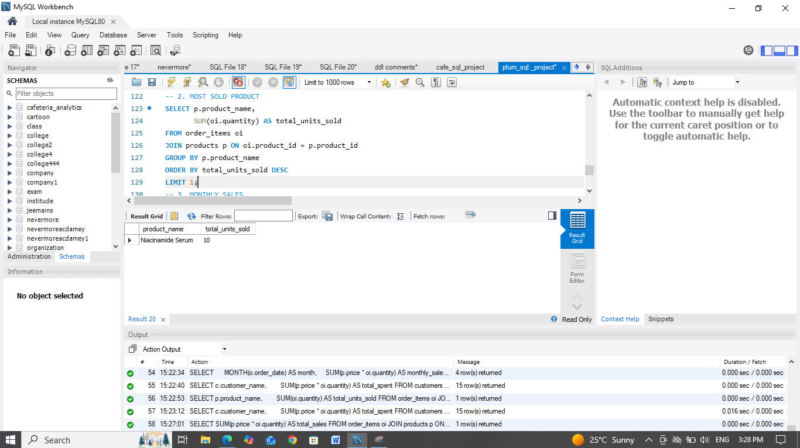
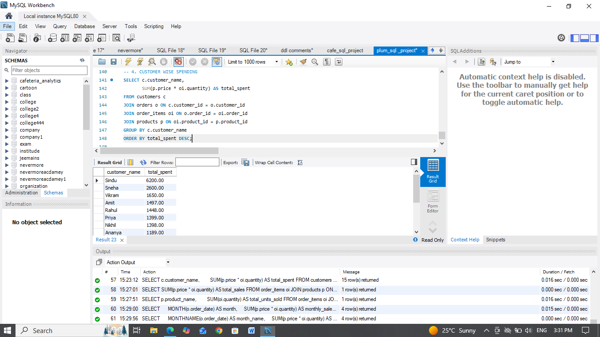
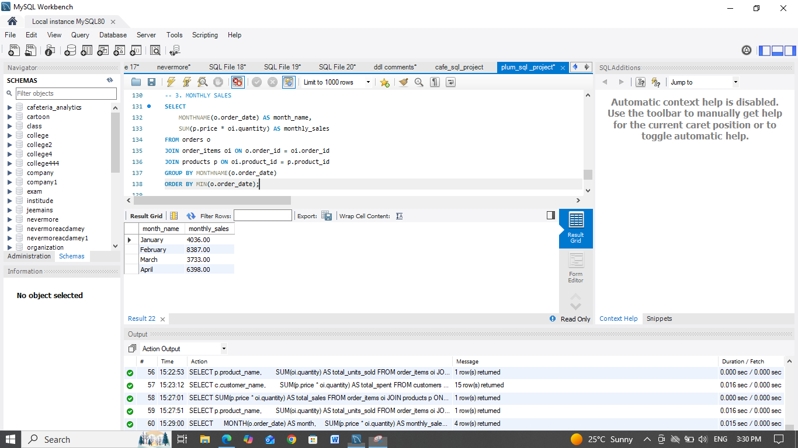

# Plum Analytics Database 🧴📊

[](https://www.mysql.com/)

## Overview
**Plum Analytics DB** is a comprehensive SQL database for analyzing sales data of Plum Cosmetics - a vegan, cruelty-free beauty brand. It tracks products across Skincare, Haircare, and Bodycare categories, customer orders, and key business metrics.

**Key Features**:
- Full relational schema (5 tables with foreign keys)
- Realistic sample data (9 products, 15 customers, 16 orders)
- Ready-to-run analytics queries for:
  - Total sales
  - Most sold products
  - Monthly sales trends
  - Customer-wise spending
- MySQL-compatible (tested with MySQL Workbench/CLI)

## 🎯 Quick Start
1. Open `plum_db_sql project.sql` in MySQL Workbench or any MySQL client.
2. Execute the entire script to:
   - Create `plum_analytics_db` database
   - Build tables and insert sample data
3. Run individual analytics queries from the script or separate files.

**CLI Example** (with MySQL installed):
```
mysql -u root -p < plum_db_sql project.sql
USE plum_analytics_db;
```

## 🗄️ Database Schema

```mermaid
erDiagram
    categories ||--o{ products : \"has\"
    customers ||--o{ orders : \"places\"
    orders ||--o{ order_items : \"contains\"
    products ||--o{ order_items : \"ordered\"
    
    categories {
        int category_id PK
        varchar category_name
    }
    products {
        int product_id PK
        varchar product_name
        int category_id FK
        varchar product_type
        decimal price
        boolean is_vegan
        boolean is_cruelty_free
    }
    customers {
        int customer_id PK
        varchar customer_name
        varchar gender
        varchar city
    }
    orders {
        int order_id PK
        int customer_id FK
        date order_date
    }
    order_items {
        int order_item_id PK
        int order_id FK
        int product_id FK
        int quantity
    }
```

**Sample Data Stats**:
| Entity | Count |
|--------|-------|
| Categories | 3 |
| Products | 9 (all vegan/cruelty-free) |
| Customers | 15 (Bangalore, Chennai, etc.) |
| Orders | 16 (Jan-Apr 2025) |
| Order Items | 20 |

**Total Sales**: ~₹15,000+ (run query to see exact)

## 🔍 Key Analytics Queries

### 1. Total Sales
```sql
SELECT SUM(p.price * oi.quantity) AS total_sales
FROM order_items oi JOIN products p ON oi.product_id = p.product_id;
```


### 2. Most Sold Product
```sql
SELECT p.product_name, SUM(oi.quantity) AS total_units_sold
FROM order_items oi JOIN products p ON oi.product_id = p.product_id
GROUP BY p.product_name ORDER BY total_units_sold DESC LIMIT 1;
```


### 3. Monthly Sales
```sql
SELECT MONTHNAME(o.order_date) AS month, SUM(p.price * oi.quantity) AS sales
FROM orders o JOIN order_items oi ON o.order_id = oi.order_id
JOIN products p ON oi.product_id = p.product_id
GROUP BY MONTH(o.order_date) ORDER BY MIN(o.order_date);
```


### 4. Customer Wise Spending
```sql
SELECT c.customer_name, SUM(p.price * oi.quantity) AS total_spent
FROM customers c JOIN orders o ON c.customer_id = o.customer_id
JOIN order_items oi ON o.order_id = oi.order_id JOIN products p ON oi.product_id = p.product_id
GROUP BY c.customer_name ORDER BY total_spent DESC;
```


## 📈 Sample Query Outputs
Run the queries to explore! Data is from early 2025 orders.

## Additional Files
- Individual query files (e.g., `Total sales`, `Customer wise Spending`) for quick execution.
- PNG screenshots of visualizations.

## Contributing
1. Fork the repo.
2. Add new queries/visuals.
3. Open PR!

**License**: MIT

